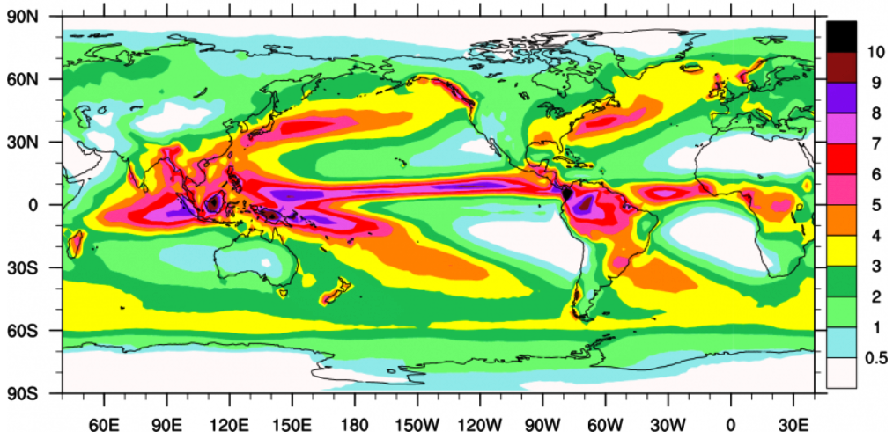

```{r setup, include=FALSE}
knitr::opts_chunk$set(echo = TRUE, message = FALSE, warning = FALSE, comment = "")
```

## Introduction

I recently came across a map showing the climatological annual distribution of rainfall shown in figure \@ref(fig:fig1). I was fascinated with the visual appeal of this map. The map clearly convey the message with clarity, simplicity and visual appeal, which spark my thinking and paused for a moment to figure out how could I make a similar plot like figure \@ref(fig:fig1), which was made in MATLAB in R?. 


```{r fig1, fig.cap="Climatological annual mean precipitation (mm/day) for 1979-2010", echo=FALSE}

# 

cowplot::ggdraw()+
  cowplot::draw_image("./Global Precipitation Climatology Project1.png")
```


For those who are unfamiliar with R or who have a broad experience of working with MATLAB, R has two major paradigms for producing plots. The first is the *base graphics* system---the sequence of functions bundled with R that are part of the graphics package, which is core and install automatically when you install the software. The second paradigm is the **ggplot2** package, written and maintained by -@ggplot, which use the *the grammar of graphics* approach to make maps and plots. The **ggplot2** is specifically designed to work with data stored in tabular format like the data frame or tibble. 

One thing that I always like the **ggplot2** package approach is that the plots are made by adding layer on top of the previous layer. Therefore, this post is not focusing on anything oceanographic, but on a little trick on making a map that get the message across with the clarity, simplicity and visual appeal. We intend to use R to make map similar to  figure \@ref(fig:fig1), which was made in MATLAB. 


## Handling data

Before you start working on the visual part of any visualization, you acctully need data. The data is what makes a visualization interesting. For this post we use the Global Precipitation Climatology Project (GPCP) Monthly Analysis Product, which was accessed from [this link](https://www.ncei.noaa.gov/data/global-precipitation-climatology-project-gpcp-monthly/access/). Further information about the dataset can obtained from NOAA website through this [link](https://www.ncdc.noaa.gov/cdr/atmospheric/precipitation-gpcp-monthly). In addition to precipitation dataset, we need the shapefile data that show the continents of the global. 


## Required packages

Obviously, we need to load the **tidyverse** [@tidyverse] together with the **metR** [@metr], **sf** [@sf] and **lubridate** [@lubridate] package. note that I'm using the latest version of these package. 

```{r}
require(metR)
require(tidyverse)
require(sf)
require(lubridate)
require(ncdf4)
```


If you are new to netCDF files, they can be a little overwhelming. We can use the `ncdump::NetCDF()` function to obtain information about the NetCDF file in a convinient form. From table \@ref(tab:tab1), we notice that the precipitation dataset has four variables `time`, `lat`, `lon`, and `precip`. The length of each of these variables are presented in table \@ref(tab:tab2).


```{r , eval=FALSE}

meta = ncdump::NetCDF("./precip.mon.mean.nc")

meta$variable %>% select(name, units, longname) %>% knitr::kable(caption = "Variables present in the precipitation dataset")
```

```{r tab1, echo=FALSE}
meta = ncdump::NetCDF("e:/Data Manipulation/trmm_precipitation/precip.mon.mean.nc")

meta$variable %>% select(name, units, longname) %>%
  kableExtra::kable(format = "html", 
                    caption = "Variables present in the precipitation dataset", align = "l", col.names = c("Variable", "Units", "Long name")) %>%
  kableExtra::column_spec(column = 1:3, width = "8cm")
```


```{r tab2}
meta$dimension %>% select(name, len,) %>% slice(1:3) %>% 
  kableExtra::kable(format = "html",caption = "Dimensions of the variable in the precipitation dataset ",
                    col.names = c("Variable name", "length")) %>%
   kableExtra::column_spec(column = 1:2, width = "5cm")
```

Once we have the information about the file, We can then use the `nc_open()` function from **ncdf4** package [@ncdf4] to read netCDF file. 
```{r}
trmm = nc_open("e:/Data Manipulation/trmm_precipitation/precip.mon.mean.nc")
```

Then call `ncvar_get` to read the data from a variable in the file. The time is in julian format and since we know the begin time, we can convert the the original time to julian and the add it to the julian day. Once we have the time in the right format, we convert them into  gregorian calendar. The **insol** package [@insol] provide the functions for date conversion from *julian* to *gregorian.*

```{r}

lon= ncdf4::ncvar_get(trmm, "lon")
data = ncdf4::ncvar_get(trmm, "precip")
lat= ncdf4::ncvar_get(trmm, "lat")
t= ncdf4::ncvar_get(trmm, "time")

## convert the original date to julian and add the julian day
time = insol::JD(lubridate::ymd("18000101", tz = ""))+t

## convert julian to gregorian date
date = insol::JD(time, inverse = TRUE) %>% as.Date()

```

We can check the length and dimension of the variables using the `length()` and `dim()` functions. We notice that there 144 spacing of longitude and 72 spacing of latitude for over 483 months between `r date[1]` an `r date[483]`


```{r}
length(lon); length(lat);length(date);dim(data)


```


## Formatting data

Different visualization tools use different data formats, and the structure you use varies by the story you want to tell. Most people are used to working with data in Excel and **ggplot2** capitalize on this idea of working with data structured in tabular format like Excell. unfortunate, the precipitation dataset downloaded as netcdf format. That means to make use of this dataset, we ought to convert the data from the original format to **ggplot2**--readable. R has bunch of tools to assist with that. However, I created several function to smooth to process that extends the data manipulation in R. The file contains three main functions that we will use. These include

+ `matrix_tb`: convert matrix into data frame
+ `FirstCap` : Capitalize the first letter of the word. This is an extension of the `toupper()` and `tolower()`
+ `gridding_semba`: used to interpolate irregular points into equal spaced regular grids. The extended functions in R can be load with the `source()` function. 


```{r, echo=FALSE}
source("e:/Data Manipulation/semba_functions.R")
```


```{r, eval=FALSE}
source("./semba_functions.R")
```


We then convert the matrix in array representing precipitation for each month into a data frame and store them in the list file. 

```{r}
trmm.tb = list()

for (n in seq_along(date)){
trmm.tb[[n]] = matrix_tb(lon, lat, data[,,n])%>% 
  mutate(date = date[n]) %>% 
  select(date, lon = x, lat = y, rain = value)
  
}

```

Then we unlist the data frame and arrange them in rows and convert the longitude format from 0--360 to -180 to 180 degrees as shown in table \@ref(tab:tab3). 


```{r }
trmm.tb = trmm.tb %>% 
  bind_rows() %>% 
  mutate(lon = lon)


```

```{r tab3, echo=FALSE}

trmm.tb %>% sample_n(8) %>% arrange(date) %>% 
  kableExtra::kable(format = "html",
                    col.names = c("Date", "Longitude", "Latitude", "Rainfall"),
                    caption = "Sample of precipitation dataset arranged in data frame converted from array of matrix") %>%
  kableExtra::column_spec(column = 1:4, width = "3cm")
```

To obtain the global climatological annual precipitation value, we used `group_by()` and `summarise()` functions from **dplyr** [@dplyr] package as highlighted in the chunk block below

```{r}
trmm.tb.climatology = trmm.tb %>% 
  group_by(lon,lat) %>% 
  summarise(rain.mean = mean(rain, na.rm = TRUE)) %>% 
  ungroup()
```

Once we have the precipiation data set computed and arranged in the data frame, we import the shapefile of the continent boundary with `st_read()` function from **sf** package


```{r, eval=FALSE}

world = st_read("./afcntry.shp")
```

## Plotting with ggplot2

Once we have the rain data in data frame, we can use the ggplot2 and metR functions to map the distribution of rain over the global as figure \@ref(fig:fig1). First we plot the precipitation as filled contour with `metR::geom_contour_fill()` and add the continent shapefile with the `geom_sf()` function. Then, add other layers to make the map visually appealing. The chunk below highlight the code that was used to make figure \@ref(fig:trmm-clim)

```{r trmm-clim, fig.cap="Climatological annual mean precipitation (mm/day) for 1979-2010"}

ggplot()+
  geom_contour_fill(data = trmm.tb.climatology %>% filter(lat > -62 & lat < 62), 
                    aes(x = lon, y = lat, z = rain.mean), bins = 12)+
  scale_fill_gradientn(colors = oce::oceColorsVorticity(120), limits = c(0.5,10), breaks =seq(0,11,1.5))+
  geom_sf(data = spData::world, fill = NA, col = NA)+
  coord_sf(expand = FALSE, xlim = c(10,358), ylim = c(-61,61))+
  # scale_x_continuous(breaks = seq(-150,150,50))+
  scale_y_continuous(breaks = seq(-60,60,30))+
  guides(fill = guide_legend(title = "mean rainfall (mm/day)", 
                             keyheight = 1.55,
                             title.position = "right",
                             title.theme = element_text(angle = 90, size = 12)))+
  theme_bw()+
  theme(axis.text = element_text(size = 11, colour = 1))+
  labs(x = NULL, y = NULL)
  
```

## Conclusion
We have seen that combining the function from **metR** package with gfunctions from **gplot2** package, we are able to make maps that show the distribution of precipitation around the global. From figure \@ref(fig:trmm-clim), we notice that the regions that receive high rainfall are those close to the equator. 

## References

